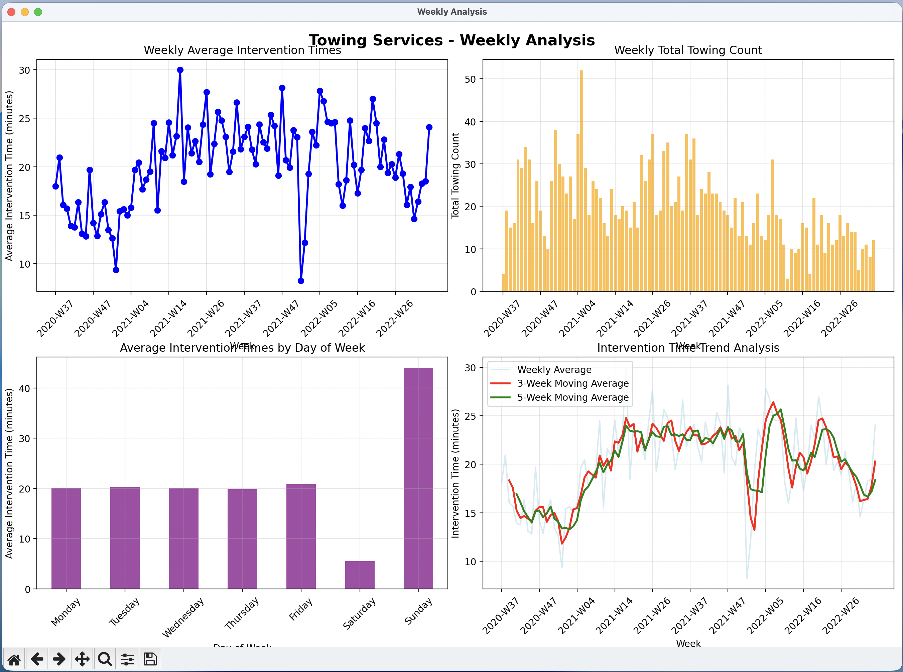
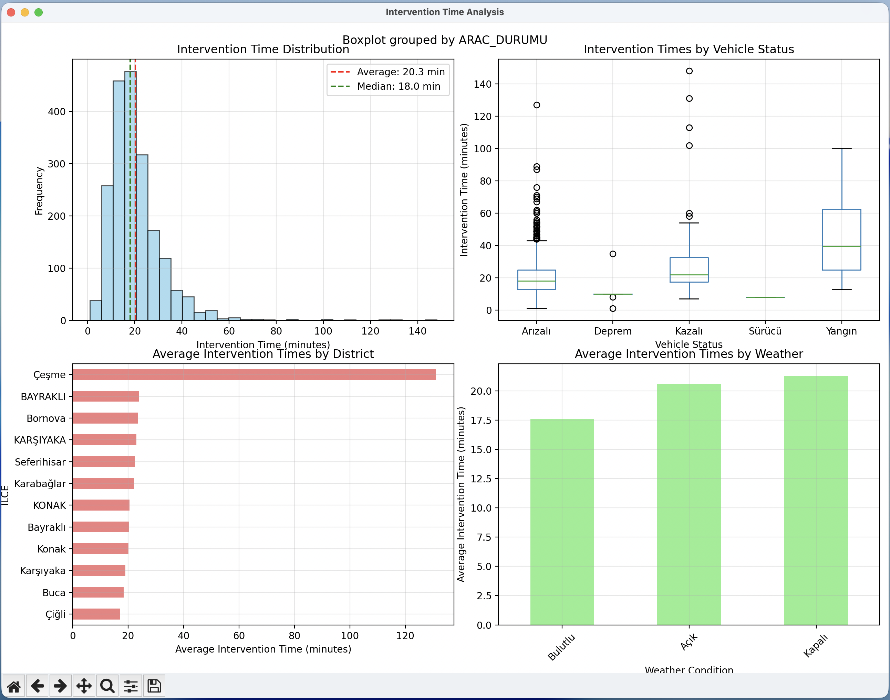

Data visualization assignment for Data Analysis and Visualization lecture.

Data source: 
https://acikveri.bizizmir.com/tr/dataset/izmir-ulasim-merkezi-tarafindan-gerceklestirilen-cekici-hizmeti-verileri

python3 main.py

to run in watch mode;
chmod +x ./watch.sh
./watch.sh

watch mode watches the changes in main.py file and restarts the app when the file is saved. 

## Screens

### Weekly Data Analysis

### Intervention Analysis

